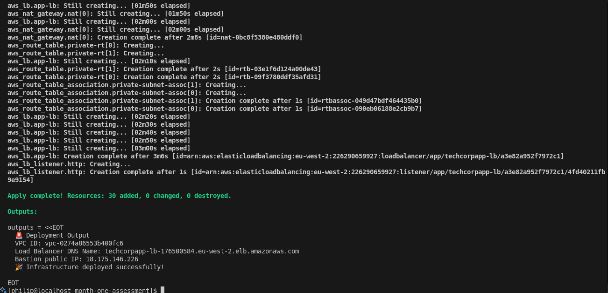
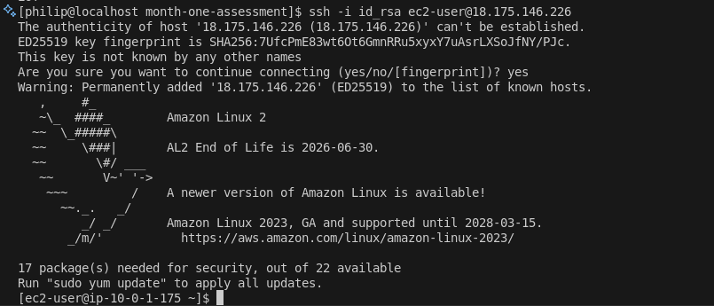
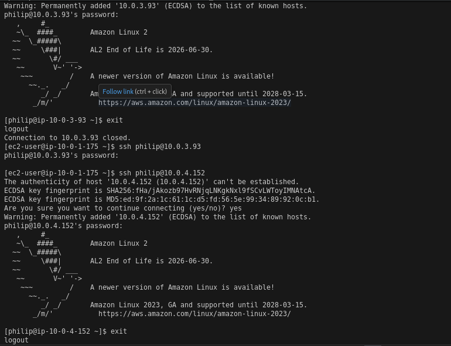
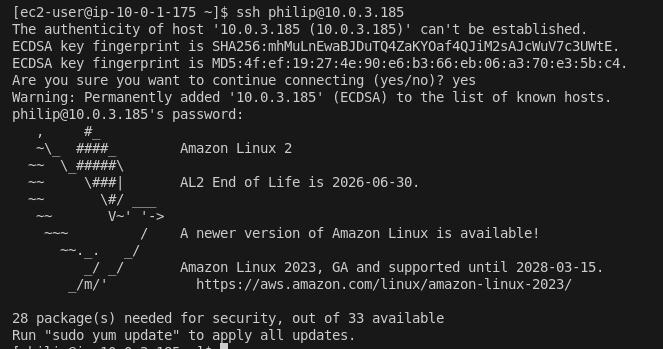
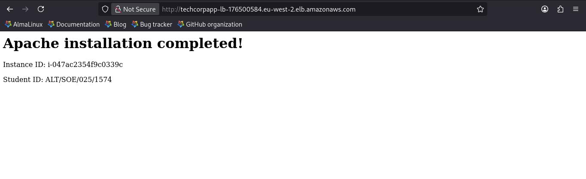
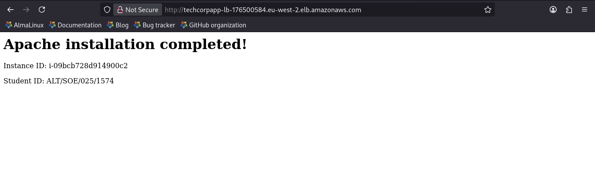

# 🚀 Month 1 Assessment


## 🧩 Assessment Scenario

You are working as a junior cloud engineer at TechCorp, and your team needs to deploy a new web application infrastructure on AWS. The senior engineer has provided you with the requirements below. You need to create a complete Terraform configuration that provisions the required infrastructure.

---

## 📘 Business Requirements:

TechCorp is launching a new web application that needs:

- High availability across multiple availability zones
- Secure network isolation with public and private subnets
- Load balancing for web traffic
- Bastion host for secure administrative access
- Scalable architecture that can grow with the business

---

## 🧰 Technical Requirements

You must create Terraform configurations to provision the following AWS infrastructure:

1. **Virtual Private Cloud (VPC)**

   - VPC with CIDR block 10.0.0.0/16
   - Name tag: techcorp-vpc
   - Enable DNS hostnames and DNS support

2. **Subnets**

   Create the following subnets in t**wo different availability zones**:

   - **Public Subnets:**
     - techcorp-public-subnet-1 - CIDR: 10.0.1.0/24
     - techcorp-public-subnet-2 - CIDR: 10.0.2.0/24
   - **Private Subnets:**
     - techcorp-private-subnet-1 - CIDR: 10.0.3.0/24
     - techcorp-private-subnet-2 - CIDR: 10.0.4.0/24

3. **Internet Gateway & NAT Gateways**

   - Internet Gateway attached to the VPC
   - NAT Gateway in each public subnet for private subnet internet access
   - Appropriate route tables and associations

4. **Security Groups**

   - **Web Security Group:** Allow HTTP (80), HTTPS (443) from anywhere, SSH (22) from Bastion Security Group.
   - **Database Security Group:** Allow MySQL (3306) only from web security group Allow SSH(22) from Bastion Security Group.
   - **Bastion Security Group:** Allow SSH (22) from your current IP address only

5. **EC2 Instances**

   - **Bastion Host:**
     - t3.micro instance in public subnet
     - Use Amazon Linux 2 AMI
     - Associate Elastic(Public) IP
   - **Web Servers:**
     - 2x t3.micro instances (one in each private subnet)
     - Use Amazon Linux 2 AMI
     - Install Apache web server (user data script)
   - **Database Server:**
     - 1x t3.small instance in private subnet
     - Use Amazon Linux 2 AMI
     - Install PostgresDB using (user data script)

   **NOTE:** Setup Access from Bastion to Web and Dev servers using username and password. Usage of ssh keys is an optional alternative.

6. **Application Load Balancer**

   - Application Load Balancer in public subnets
   - Target group pointing to web servers
   - Health check configuration

7. **Variables and Outputs**

   - Use variables for: region, instance types, key pair name, your IP address
   - Output: VPC ID, Load Balancer DNS name, Bastion public IP

---

## 📂 Project Structure

```
month-one-assessment/
├── evidence/                   # Deployment evidence folder
├── user_data/
│   ├── db_server_setup.sh      # Database server config file
│   └── web_server_setup.sh     # Web server config file
│
├── main.tf                     # Infrastructure provisioning file
├── outputs.tf                  # Infrastructure output file
├── variables.tf                # Infrastructure variable file
├── .gitignore                  # Gitignore file
└── README.md                   # Project documentation
```

---

## ⚙️ Setup and Installation

### 🧾 Prerequisites

- Terraform installed and configured.
- AWS CLI installed and configured.

### 🏗️ Step-by-Step Setup

1. Clone the Repository

   ```bash
   git clone https://github.com/PhilipOyelegbin/month-one-assessment.git
   cd month-one-assessment
   ```

2. Create an SSH key

   ```bash
   ssh-keygen -t rsa -b 4096 -f id_rsa -N ''
   ```

3. Run the Infrastructure Provisioner

   > Update the defined variables in the files [webserver script](./user_data/web_server_setup.sh) and [dbserver script](./user_data/db_server_setup.sh)

   ```bash
   terraform init          # Initialize the terraform project
   terraform fmt           # Format the terraform files
   terraform validate      # Validate the terraform script
   terraform plan          # Plan the terraform deployment
   terraform apply         # Apply the terraform deployment
   ```

   

4. SSH into each servers

   ```bash
   # SSH into the bastion server
   ssh -i id_rsa ec2-user@<BASTION-SERVER-IP>

   # SSH into the web servers from bastion host
   ssh <USERNAME>@<WEB-SERVER1-IP>
   ssh <USERNAME>@<WEB-SERVER2-IP>

   # SSH into the database server from bastion host
   ssh <USERNAME>@<DATABASE-SERVER-IP>
   ```

   
   
   
   

5. Preview the web server in the browser via the load balancer dns

   
   

   > Other deployment evidence can be found **[HERE](./evidence/)**.

6. Clean up the resources

   ```bash
   terraform destroy
   ```

---
